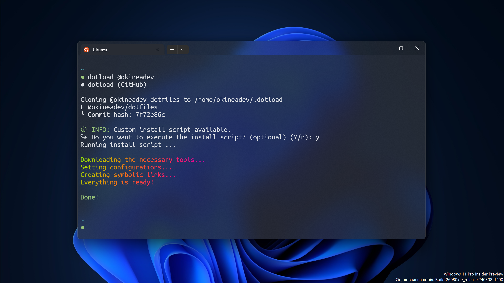

<!-- markdownlint-disable no-inline-html first-line-h1 -->

<div align="center">
  <a href="https://github.com/cli-stuff/dotload">
    <!-- https://docs.github.com/en/get-started/writing-on-github/getting-started-with-writing-and-formatting-on-github/basic-writing-and-formatting-syntax#specifying-the-theme-an-image-is-shown-to -->
    <picture>
      <source media="(prefers-color-scheme: dark)" srcset="public/banner-dark.png" alt="Banner">
      <source media="(prefers-color-scheme: light)" srcset="public/banner-light.png" alt="Banner">
      
    </picture>
  </a>

<br>
<br>

**dotload** - **Simple** and **intuitive** tool for installing dotfiles on any machine!

[**Installation**](#%EF%B8%8F-installation) · [**Report Bug**](https://github.com/cli-stuff/dotload/issues/new?labels=bug&template=bug_report.md) · [**Request Feature**](https://github.com/cli-stuff/dotload/issues/new?labels=enhancement&template=feature_request.md)

</div>

## ℹ️ About the project

<br>

<picture>
  <source media="(prefers-color-scheme: dark)" srcset="public/screenshot-dark.png" alt="Screenshot">
  <source media="(prefers-color-scheme: light)" srcset="public/screenshot-light.png" alt="Screenshot">
  
</picture>

<br>

`dotload` works by cloning the specified user's **GitHub** dotfiles repository

This tool was created to make it as **easy as possible** to install dotfiles and other required packages.

### 🤔 How does it work?

This tool makes symbolic links to your dotfiles from `~/.dotload` to `$HOME` directory

It can also make symbolic links to folders (including subfolders) whose name starts with a dot, for example `.configs`

> [!WARNING]
> Dotfiles with identical names will be inevitably overwritten with new ones from your repository!

For example, if you have a file `~/.bashrc` on your computer and in the repository, it will be overwritten with a new one from the repository, before cloning them, make sure that they are yours or you have made a backup of previous configurations

## ⚙️ Installation

You can run without installation on **any** OS with this command:

```bash
bash <(curl -sL https://cutt.ly/dotload) @username
```

If you want to install it on your system, you can run the following command:

```bash
curl -sL https://cutt.ly/dotload-install | bash
```

🗑️ **Uninstall**:

```bash
sudo rm ${PREFIX:-/usr$([ "$(uname)" = "Darwin" ] && echo "/local")}/bin/dotload && hash -r
```

> [!NOTE]
> If you want to remove this tool from **Termux**, you need to run the above command without `sudo`

### Additional installation methods

<details>
  <summary><b>Homebrew</b></summary>
  <br/>

With [**brew**](https://brew.sh/) you can install this tool on **macOS** (and **Linux** too)

> ℹ️ Note: If you don't have [**brew**](https://brew.sh/) installed, install it **now** with this command:

```bash
/bin/bash -c "$(curl -fsSL https://raw.githubusercontent.com/Homebrew/install/HEAD/install.sh)"
```

  <hr/>

📥 **Install**:

```bash
brew tap cli-stuff/dotload
brew install dotload
```

</details>

<details>
  <summary><b>Termux</b></summary>
  <br/>

You will also receive further updates with this method

```bash
# Add Termux User Repository
pkg install tur-repo
pkg update && pkg install dotload
```

</details>

### Compatibility table

| <div></div> **Linux** | <div></div> **Termux** | <div></div> **macOS** | <div></div> **Windows** (on [msys shell](https://www.msys2.org/)) |
| :-------------------------------------------------------------------------------------------------------------------------------------: | :----------------------------------------------------------------------------------------------------------------------------: | :-----------------------------------------------------------------------------------------------------------------------------------------------------------------------------------------------: | :---------------------------------------------------------------------------------------------------------------------------------------------------------------------------------------------------: |
|                                                                   ✅                                                                    |                                                               ✅                                                               |                                                                                                ✅                                                                                                 |                                                                                                  ✅                                                                                                   |

## 🚀 Usage

```bash
dotload @username
dotload @username/repo_name
dotload https://github.com/username/dotfiles.git
```

Where `username` is the **GitHub username** whose dotfiles you want to clone.

`repo_name` - Name of your **dotfiles repository**, if not specified - `dotfiles` name will be used by default

You can also use URLs of repositories such as **GitLab**, **Codeberg**, etc.

> [!WARNING]
> The username cannot contain emojis, spaces or other non-standard characters

### Advanced Usage

```bash
dotload @username branch_name
```

> [!TIP]
> You can also use `-b` or `--branch` flags:

```bash
dotload @<username> [--branch branch_name | -b branch_name]
dotload <repo_url> [--branch branch_name | -b branch_name]
```

Where `branch_name` is the branch of the repository you want to clone. If not specified, the default branch is used. This can be useful if you have multiple machine usage scenarios

---

Use the `--help` flag to get help:

```bash
dotload --help
# Help page...
```

### Custom installation scripts

You can also add an installation script to your `dotfiles` repository to fully automate the installation and get more features

The installation file can have the following names and locations:

-   _install.sh_
-   _install_
-   _bootstrap.sh_
-   _bootstrap_
-   _script/bootstrap_
-   _setup.sh_
-   _setup_
-   _script/setup_

If none of these files are found, then any files or folders in your selected dotfiles repository starting with `.` are automatically symlinked to the `$HOME` directory.

### Configuration

You can also **specify a custom installation script**
or make it optional in `dotload.conf`, for this read the [**dotload.conf documentation**](docs/dotload_conf.md)

## 🤝 Contributing

Contributions are what make the open-source community such an amazing place to learn, inspire, and create. Any contributions you make are **greatly appreciated**.

You can start developing on [**GitHub Codespaces**](https://github.com/features/codespaces) right away

[](https://codespaces.new/cli-stuff/dotload?quickstart=1)

This repository has ⚡[**prebuilds**](https://docs.github.com/en/codespaces/prebuilding-your-codespaces/about-github-codespaces-prebuilds) that allow you to **skip** installing packages and tools.

Or use the usual method on your computer:

1. Fork the Project
2. Create your Feature Branch (`git checkout -b feature/AmazingFeature`)
3. Commit your Changes (`git commit -m 'Add some AmazingFeature'`)
4. Push to the Branch (`git push origin feature/AmazingFeature`)
5. Open a Pull Request

Please make sure to update tests as appropriate.

Also, please read our [**Code of Conduct**](CODE_OF_CONDUCT.md), and follow it in all your interactions with the project.

## 📝 License

This project is [**MIT**](https://opensource.org/license/MIT) licensed.

See [**LICENSE**](LICENSE)

## ❤️ Support

If you like this project, consider supporting it by starring ⭐ it on GitHub, sharing it with your friends, or [buying me a coffee ☕](https://github.com/cli-stuff/dotload?sponsor=1)
